# Authentication, Sessions, Tokens & Revocation

This document is the readable guide to how login works in Plugwerk. It covers the three credential types (access JWT, refresh cookie, namespace access key), the refresh flow, the revocation mechanisms, and where OIDC fits in today and tomorrow. The authoritative decision records are the ADRs ([0020](../adrs/0020-csrf-stateless-decision.md) superseded, [0024](../adrs/0024-access-key-hmac-lookup.md), [0025](../adrs/0025-actuator-endpoint-hardening.md), [0027](../adrs/0027-refresh-cookie-and-csrf-reenabled.md)); this guide is the friendlier overview.

## TL;DR

- **Web UI users** get a short-lived (15 min) access-JWT in React memory, plus an httpOnly refresh cookie (7 d) that silently renews the access token.
- **Machine/CI clients** use long-lived namespace access keys via `X-Api-Key`.
- **External OIDC clients** present provider-issued JWTs as `Authorization: Bearer`.
- **Three independent revocation paths** (JWT blocklist, refresh-token ledger, password-invalidation timestamp) are coordinated by `AuthController` so that logout / password-change / reuse-detection all feel atomic to the user.

## The cast

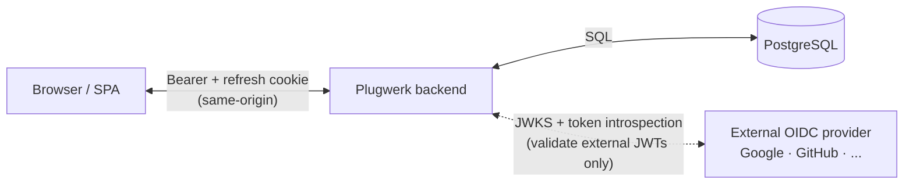

Plugwerk is a **resource server** for external OIDC tokens — it validates them but does not mint them. It is the **authorization server** for its own users (username/password login issues Plugwerk-native JWTs).

## 1. Local login — the happy path

When a user submits username and password to `POST /api/v1/auth/login`:

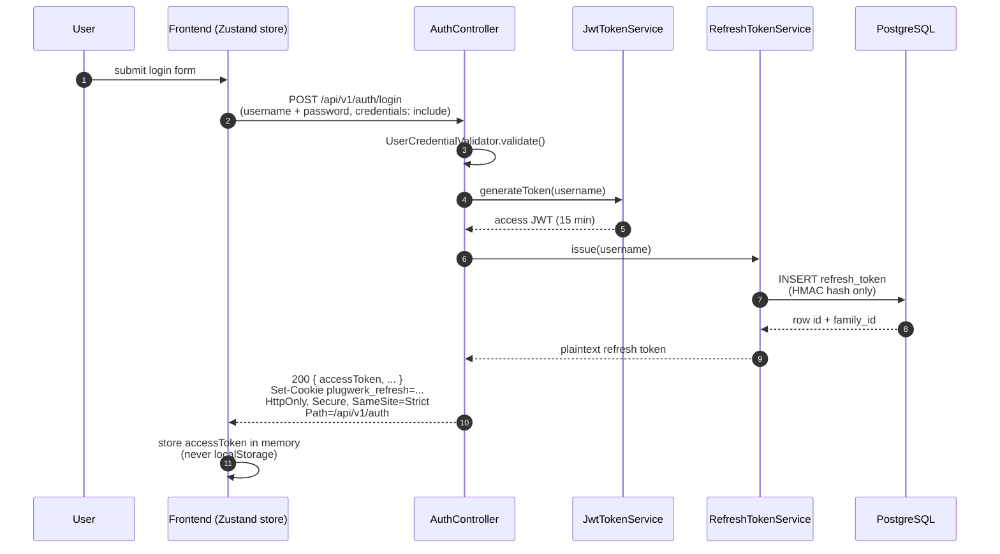

Key invariants:

- **Access JWT** lives in React memory only — no `localStorage`, no `sessionStorage`. A Vitest regression guard (`authStore.noLocalStorage.test.ts`) fails CI if any code path writes a token-like key to either.
- **Refresh cookie** is `HttpOnly` (JavaScript cannot read it), `Secure` (HTTPS-only, configurable for dev), `SameSite=Strict` (never sent on cross-site requests), scoped to `Path=/api/v1/auth`.
- **Plaintext refresh token** exists exactly once: in the `Set-Cookie` response header. The DB stores only `HMAC-SHA256(jwt_secret, plaintext)` — even a full DB dump is not enough to forge a session.

## 2. Authenticated request + expiry + silent refresh

Every subsequent API call carries the access JWT as `Authorization: Bearer`. When the 15-minute lifetime runs out, the interceptor transparently refreshes:

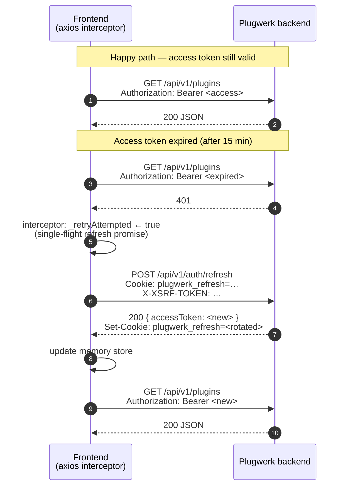

Important details:

- The retry happens **exactly once** per failed request (`_retryAttempted` flag on the axios config). If the refresh itself returns 401, the store clears and the user is redirected to `/login`.
- Concurrent failing requests share one `inFlightRefreshPromise`, so a burst of 10 expired requests triggers one refresh call, not ten.
- The refresh call requires both the cookie and the `X-XSRF-TOKEN` header (double-submit). SameSite=Strict is defence in depth for browsers that silently downgrade it.

## 3. Refresh-token rotation and family chains

Every `/auth/refresh` call **rotates**: the presented row is revoked, a successor is issued in the same family, and the cookie is replaced.

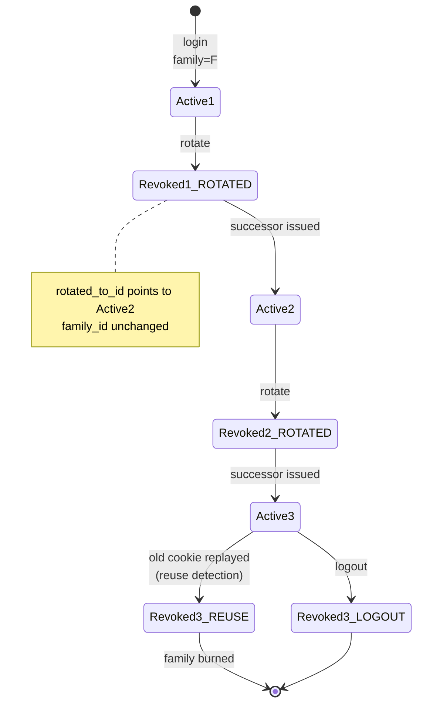

In the DB, a session's lifetime looks like this:

| id | family_id | token_hash | issued_at | revoked_at | revocation_reason | rotated_to_id |
|---|---|---|---|---|---|---|
| r1 | F | `abc…` | 12:00 | 12:15 | `ROTATED` | r2 |
| r2 | F | `def…` | 12:15 | 12:30 | `ROTATED` | r3 |
| r3 | F | `ghi…` | 12:30 | *(null)* | *(null)* | *(null)* |

Only the last row is active. The earlier rows are kept until natural expiry so **reuse detection** works — see next section.

## 4. Reuse detection — stolen cookie defence

Classic refresh-token-reuse: an attacker steals a rotated cookie and tries to use it. The legitimate user's client has already rotated past it, so the attacker's cookie is a known-revoked row. Plugwerk detects that and burns the whole family:

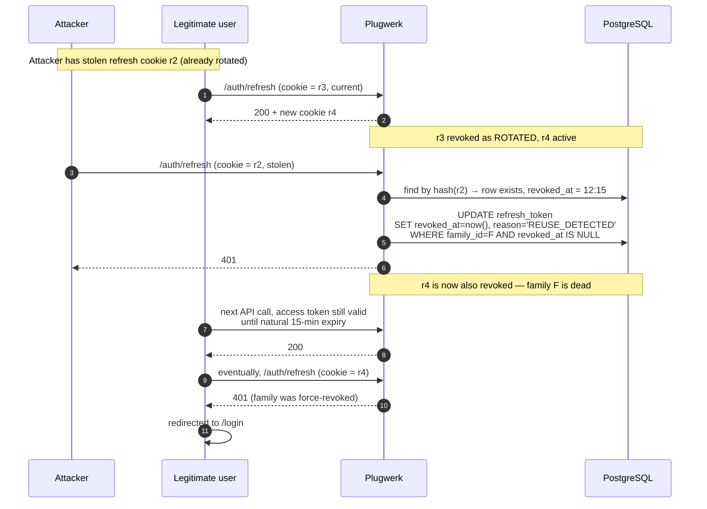

Properties:

- The legitimate user is logged out on their **next** refresh attempt — at worst 15 minutes later. Not earlier, because we don't want an attacker with a stolen cookie to be able to kick the real user out in real-time.
- The attacker is blocked immediately on their reuse attempt.
- The server logs `Refresh-token reuse detected for user_id=… family_id=…` at WARN level, which surfaces to audit/alerting.
- Unknown cookies (attacker made one up) return 401 but do **not** trigger a family revocation — there's no family to revoke. That response is indistinguishable from "expired row" on purpose.

## 5. Logout

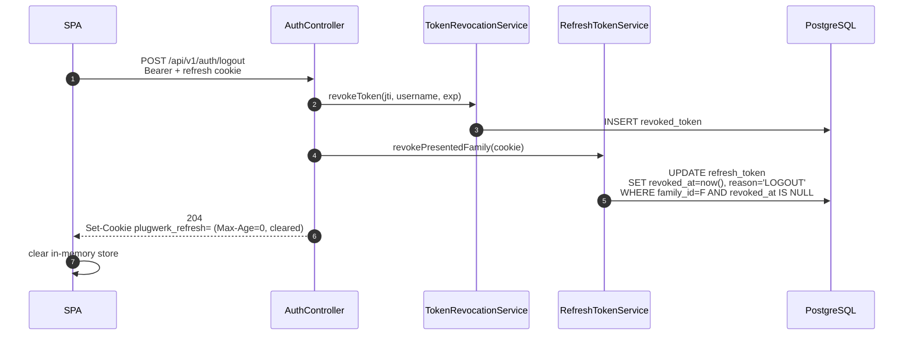

The `revoked_token` insert ensures that even if the attacker somehow copies the access-JWT out of memory (DevTools, a browser extension), it's rejected from this point forward, not just after 15 min. Redundant with the natural expiry, but cheap (one INSERT, cached after).

## 6. Password change

Password change is a **bulk** revocation: every JWT and every refresh token for the user must die.

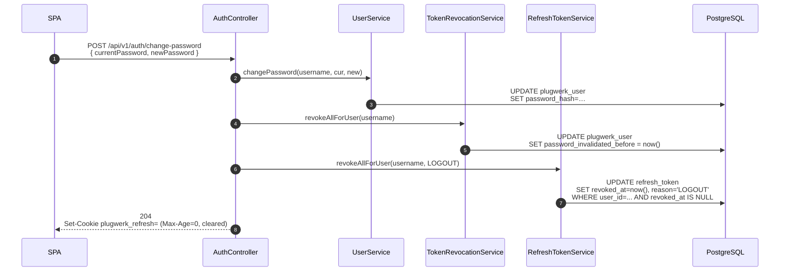

Note the trick at step 5: instead of inserting 1000 rows into `revoked_token` (one per outstanding JWT), we set **one** timestamp on the user and reject any JWT with `iat < password_invalidated_before` at decode time. Constant-time, no storage cost.

## 7. OIDC — today and tomorrow

### Today: external resource-server mode

External clients (for example a build pipeline, a custom CLI, or the PF4J client plugin configured to talk to a corporate IdP) get their JWT from the OIDC provider directly and present it to Plugwerk as `Bearer`:

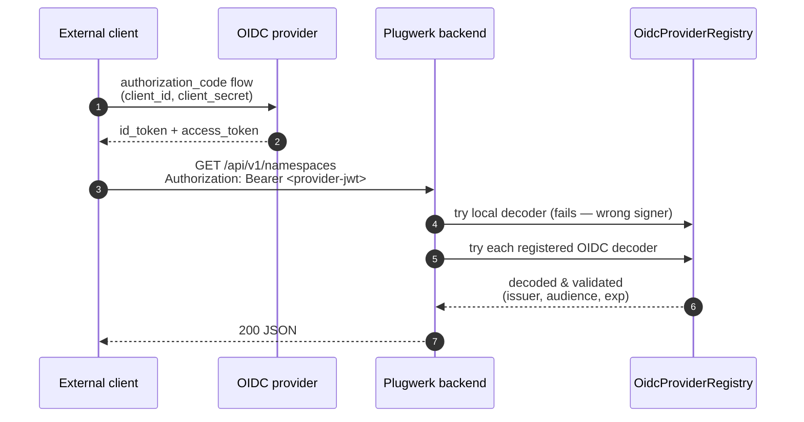

The web UI has **no** OIDC flow today. The refresh-cookie machinery described above is irrelevant for this path — external OIDC tokens are refreshed at the provider, not at Plugwerk.

### Tomorrow: web-UI token exchange (Phase 2, tracked in #315)

Phase 2 plans a "Login with Google / GitHub / …" button. The shape is already decided in ADR-0027:

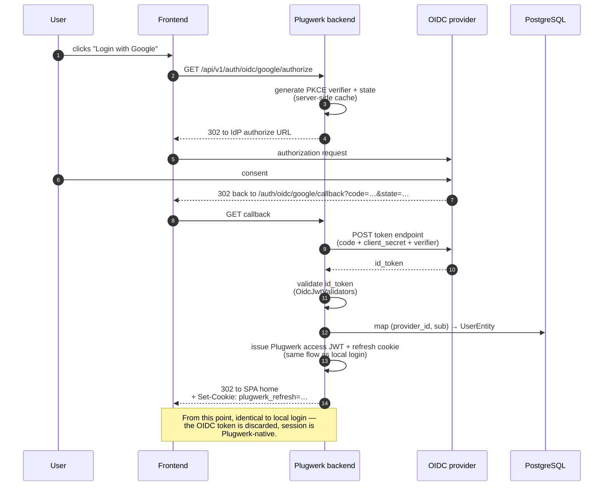

The key insight: OIDC becomes a **login event**, not a session credential. After the initial redirect dance, the session is a Plugwerk refresh cookie, so all the XSS / reuse-detection / rotation guarantees from this document automatically cover OIDC users.

## 8. Three revocation surfaces — at a glance

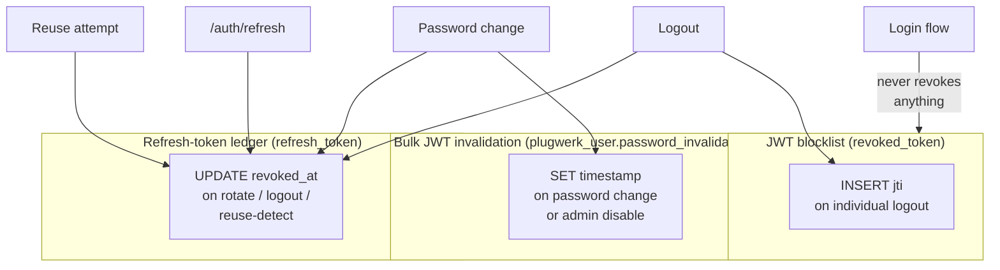

| Mechanism | Covers | Granularity | When used | Cost per check |
|---|---|---|---|---|
| `revoked_token` (INSERT jti) | Access JWTs | One token | Individual logout | O(1) via Caffeine cache |
| `password_invalidated_before` | **All** user's past JWTs | Whole user | Password change, admin disable | O(1) — one column read on user row already fetched for principal |
| `refresh_token.revoked_at` | Refresh tokens | One row, or whole family | Every `/auth/refresh`, logout, password change, reuse-detect | O(1) via UNIQUE index probe |

Why three? Because the three credential classes (short-lived stateless JWT, long-lived opaque refresh token, and "all past tokens for this user") have different access patterns. Picking one mechanism for all of them would be either slow (persist every JWT) or weak (no reuse detection).

## 9. CSRF scope

Bearer tokens and access keys are **not** ambient credentials — an attacker site cannot force your browser to add them to a cross-site request. The refresh cookie **is** ambient (the browser attaches it automatically to any request to the same origin). Therefore:

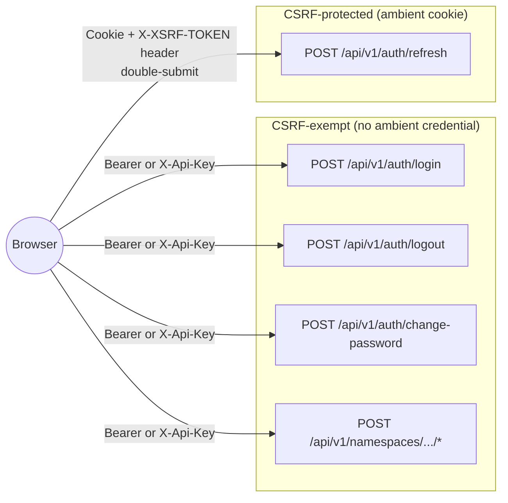

This scope is pinned by [`CsrfScopeIT`](../../plugwerk-server/plugwerk-server-backend/src/test/kotlin/io/plugwerk/server/config/CsrfScopeIT.kt) — any future refactor that accidentally broadens CSRF to other endpoints fails that test.

## References

- [ADR-0024 — Access-key HMAC lookup](../adrs/0024-access-key-hmac-lookup.md) — the pattern the refresh-token table reuses.
- [ADR-0027 — Refresh cookie and CSRF re-enabled](../adrs/0027-refresh-cookie-and-csrf-reenabled.md) — supersedes ADR-0020, contains the decision record and threat model.
- [ADR-0020 — CSRF disabled (superseded)](../adrs/0020-csrf-stateless-decision.md) — kept for history.
- [AGENTS.md](../../AGENTS.md) — operator-facing env vars and the 1.0.0-beta.1 upgrade note.
- Code entry points:
  - [`AuthController`](../../plugwerk-server/plugwerk-server-backend/src/main/kotlin/io/plugwerk/server/controller/AuthController.kt) — login, refresh, logout, change-password.
  - [`RefreshTokenService`](../../plugwerk-server/plugwerk-server-backend/src/main/kotlin/io/plugwerk/server/service/RefreshTokenService.kt) — rotation, reuse detection, cleanup.
  - [`TokenRevocationService`](../../plugwerk-server/plugwerk-server-backend/src/main/kotlin/io/plugwerk/server/service/TokenRevocationService.kt) — JWT blocklist.
  - [`SecurityConfiguration`](../../plugwerk-server/plugwerk-server-backend/src/main/kotlin/io/plugwerk/server/config/SecurityConfiguration.kt) — filter chain, CSRF scope.
  - [`authStore.ts`](../../plugwerk-server/plugwerk-server-frontend/src/stores/authStore.ts) — frontend store.
  - [`api/refresh.ts`](../../plugwerk-server/plugwerk-server-frontend/src/api/refresh.ts) — single-flight refresh.
